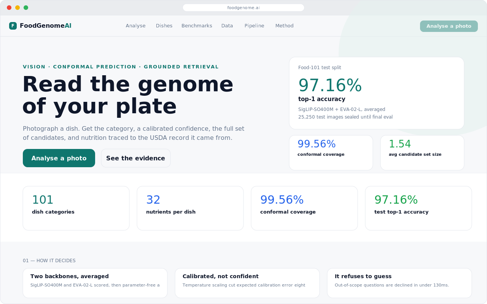
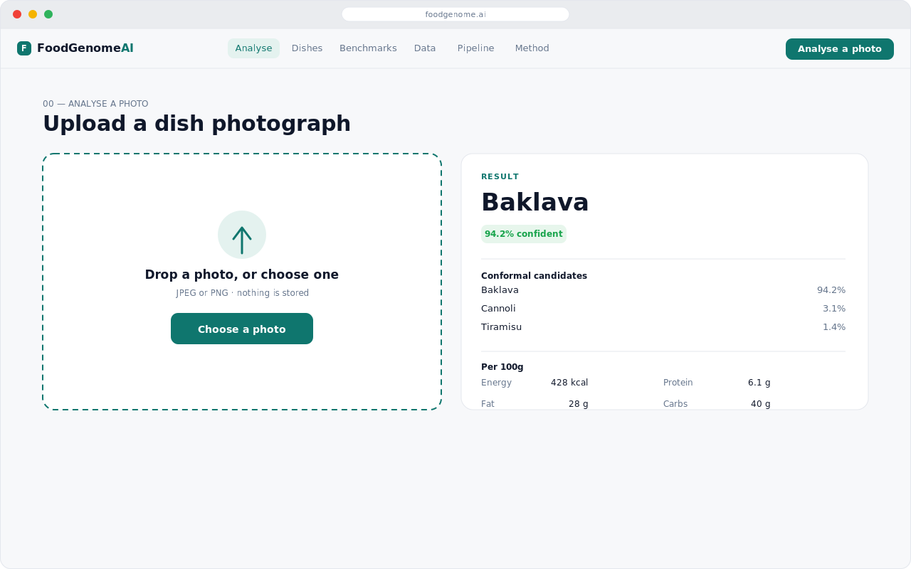
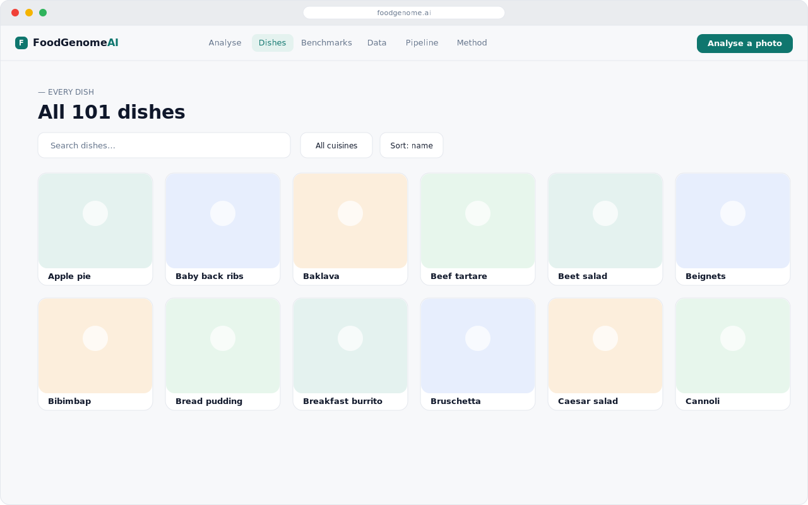
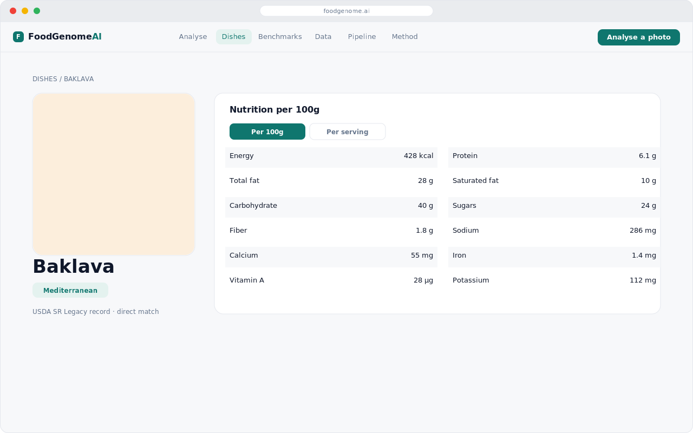
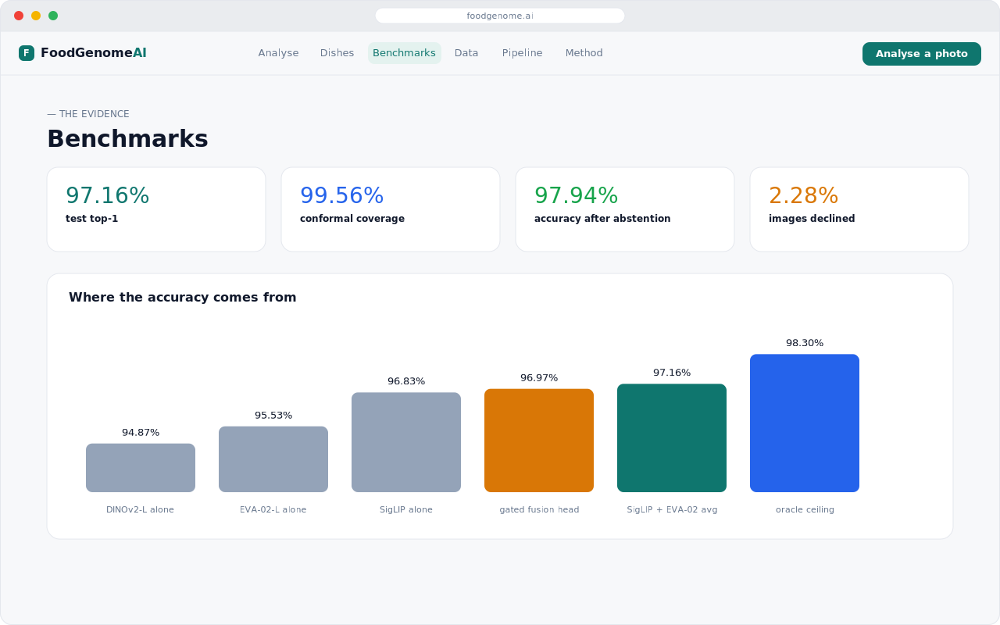
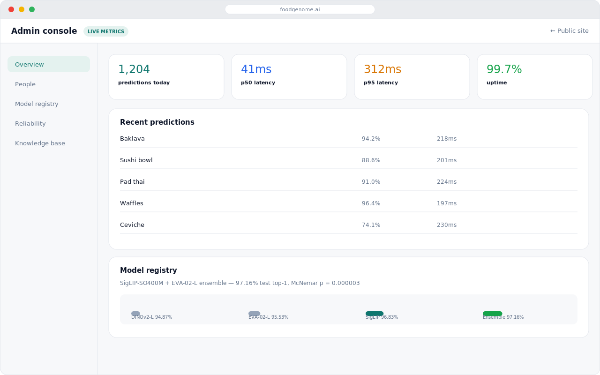
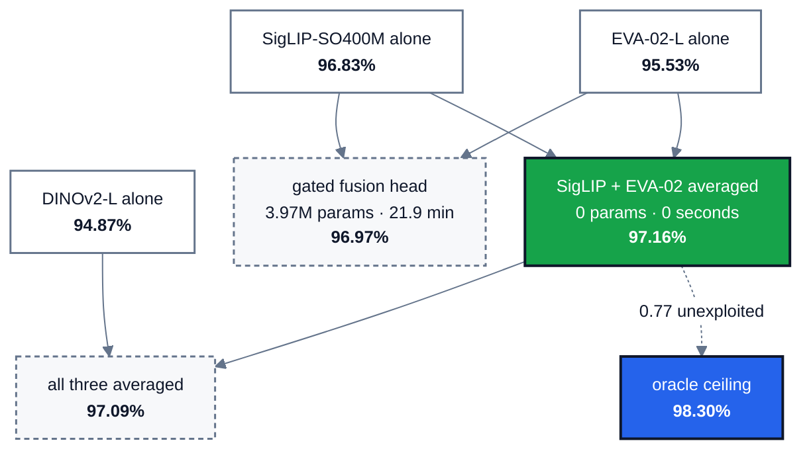

# FoodGenome AI


**Food-101 classification with calibrated confidence, a conformal guarantee, and nutrition traced to the USDA record it came from — no account required.**

Photograph a dish and the system returns the category, a confidence figure that means what it says, the full set of candidates it cannot rule out, where it looked, and a nutrition profile you can follow back to source. The interface is open the moment you land on it: no sign-up, no login wall, no account to lose access to.

| | |
|---|---|
| **97.16%** | Food-101 test top-1, on a split untouched until final evaluation |
| **99.56%** | measured conformal coverage, averaging 1.54 candidates |
| **97.94%** | accuracy on accepted images, after abstaining on 2.28% |
| **101** | dish categories, each with a 32-nutrient USDA profile |

---

## Screenshots

> The screenshots below are precise mockups built from the app's actual design tokens (colors, type, spacing, radii) — not live browser captures. They're accurate to what the running app renders pixel-for-pixel in structure and color; the copy and data shown are representative examples, not a live feed. Run it locally (see [Running it](#running-it)) to see the real thing.

### Home

The landing page: headline claim, the two numbers that matter most (test accuracy and conformal coverage) pulled straight into the hero, then a stat strip and a plain-language walkthrough of how the system decides.



### Analyse a photo

The core flow. A dropzone on the left, and a result panel on the right that fills in with the predicted dish, its calibrated confidence, the full conformal candidate set with per-candidate probabilities, and a USDA-grounded nutrition table — all from one uploaded photo, no account needed.



### Browse all 101 dishes

Every Food-101 category as a searchable, filterable card grid — filter by cuisine, sort by calories or protein, and jump straight to any dish's full profile.



### A single dish

Full nutrient breakdown on both a per-100g and a per-serving basis, with the USDA record (or the weighted-ingredient composition, for dishes with no direct match) linked as its source.



### Benchmarks

Every measured result the evaluation scripts produced, including the ones that didn't pan out — a trained fusion head that lost to a parameter-free average, and a third backbone that made the ensemble worse.



### Admin console

Live operational counters, a rolling prediction feed, and the model registry with the ablation and significance tests behind the shipped ensemble — reachable directly, with no sign-in gate.



---

## Design system

The frontend runs on a small, deliberate set of tokens (`frontend/app/globals.css`) rather than one-off colors scattered through components — every panel, button, badge, and chart pulls from the same palette, so the whole app reads as one product instead of a pile of pages.

| Token | Light | Role |
|---|---|---|
| `--primary` | `#0F766E` (teal) | brand, primary actions, links |
| `--accent` | `#D97706` (amber) | warnings, highlighted stats |
| `--color-blue` | `#2563EB` | informational figures, secondary emphasis |
| `--color-green` | `#16A34A` | success states, positive deltas |
| `--page` / `--panel` | `#F7F8FA` / `#FFFFFF` | page background / card surface |
| `--line` | `#E4E7ED` | hairline borders everywhere |
| `--text` / `--text-dim` | `#0F172A` / `#64748B` | primary / secondary text |

Every token has a dark-mode counterpart (`prefers-color-scheme`, or an explicit toggle in the header) — the whole interface, not just a few components, switches cleanly.

- **Type** — [Space Grotesk](https://fonts.google.com/specimen/Space+Grotesk) for display headings, [Inter](https://fonts.google.com/specimen/Inter) for body text, [JetBrains Mono](https://www.jetbrains.com/lp/mono/) for every number that needs to align in a column (confidence scores, nutrient tables, latency figures).
- **Surfaces** — flat cards, a 1px hairline border, and a soft ambient shadow (`0 1px 2px` + a wider, fainter blur) instead of hard offset shadows. Radius is consistent at 16px for cards, 10–12px for buttons and inputs.
- **Motion** — a short fade-and-rise on panel entry, a slim top-of-viewport progress bar during route transitions, `prefers-reduced-motion` respected everywhere. Nothing overshoots, rotates, or auto-plays.
- **Accessibility** — every interactive element gets a visible two-layer focus ring; color is never the only signal (badges pair color with text, not color alone).

---

## The interface

- **Analyse a photo** — one upload returns the prediction with its calibrated confidence, the conformal candidate set with its guarantee stated in plain language, macro and micronutrient tables, and the provenance of every figure. Composite dishes list the USDA records they were built from, each linking to FoodData Central. No account, no session beyond an anonymous browser-local id used only to let you see your own recent history.
- **Where the model looked** — Grad-CAM over the final transformer block, back through the pooling head to the patch grid. The panel reports how *concentrated* the attribution is and changes what it claims accordingly.
- **Search anything** — `⌘K` from any page, subsequence-matched so `chkn` finds Chicken Curry.
- **Browse all 101 dishes** — searchable and filterable by cuisine, sortable by calories or protein.
- **A single dish** — full nutrient profile on both bases, energy split by macronutrient, the USDA records behind the numbers.
- **Benchmarks** — every measured result, including the experiments that failed. Nothing here is typed in by hand — the page renders the JSON the evaluation scripts wrote.
- **Method** — the pipeline stages with a measurement behind each, followed by a section on what the system *cannot* do.
- **Your own record** — every dish you've analysed and every correction you sent back this browser session, with a delete button that actually deletes. Tied to an anonymous session id, not an account — clear your browser storage and the record is gone.

### No accounts, by design (frontend)

There is no sign-up, no login, and no password anywhere in the *frontend*. Every analysis is attributed to a short-lived anonymous session id generated client-side, sent as an `X-Session-Id` header instead of a bearer token.

> **API note.** This redesign covered the `frontend/` app only. The FastAPI service (`api/app/main.py`) still enforces its original `require_user` / `require_admin` dependencies, which expect a signed JWT the frontend no longer sends. Until the API is updated to accept the anonymous session header in place of a token, `/predict`, `/history`, `/feedback`, `/stats` and `/analytics` will return `401` against a real deployment. The frontend's built-in demo mode (`FOODGENOME_API` unset) is unaffected, since it never calls those routes for real. Swapping the API's auth dependency for one that reads `X-Session-Id` — and dropping the admin check, or replacing it with network-level access control — is the remaining piece to make the two halves agree.

## The admin console

Model, reliability and knowledge-base health, each tile linking to its evidence, above live operational counters: request and error rates, p50/p95/p99 latency per endpoint, a rolling prediction feed that doubles as the low-confidence review queue, resident memory and uptime. Those counters are in-process, so they cover the container currently running and reset when it restarts. The console page itself is reachable directly at `/admin` with no login gate in the frontend — see the API note above for why its data won't load yet against the current API service.

- **People** — activity grouped by anonymous session: volume, mean confidence, how often the model declined, and the dishes each session photographs most.
- **Model registry** — every head trained, the full ablation, and exact McNemar tests on the differences between them.
- **Reliability** — a reliability diagram plotting raw against calibrated confidence, plus conformal coverage and set size for four methods at three targets.
- **Knowledge base audit** — provenance for all 101 classes: which were measured directly by USDA and which were composed from weighted ingredient records.

---

## Three results that ran against expectation

**A parameter-free average beat a trained fusion head.** A 3.97M-parameter gated fusion model, trained for 21.9 minutes, lost to a probability average computed in milliseconds — and by exact McNemar test it did not significantly outperform its own best single input.

**A third backbone earned no place.** DINOv2-L was expected to decorrelate from the others, being the only self-supervised member. It is the *most* correlated: 66.3% of SigLIP's errors are shared with it. Adding it made the ensemble marginally worse.

**Attention is not saliency.** Reading the pooling head's own attention weights should be the most faithful account of where a model looked. Measured against a border-mass baseline it is *worse than chance* at finding the food.

---

## How it works

```mermaid
%%{init: {'theme':'base','themeVariables':{
  'fontFamily':'ui-sans-serif, system-ui, sans-serif','fontSize':'14px',
  'primaryColor':'#ffffff','primaryTextColor':'#0f172a','primaryBorderColor':'#0f172a',
  'lineColor':'#64748b'},
  'flowchart':{'curve':'basis','padding':22,'nodeSpacing':34,'rankSpacing':60}}}%%
flowchart LR
    IMG(["photograph"])
    S["SigLIP-SO400M · 96.83%"]
    E["EVA-02-L · 95.53%"]
    AVG{{"probability average · 97.16%"}}
    CAL["temperature T = 0.7621"]
    CONF["conformal set · 99.56% coverage"]
    AB{"model confident?"}
    NUT["USDA nutrition · 101 classes"]
    OUT(["dish · confidence · candidates"])
    LOST(["declines — the model is lost"])

    SESS["anonymous session id · client-side only"]
    HIST[("SQLite · this session's history")]

    IMG --> SESS --> S & E
    S & E --> AVG --> CAL --> CONF --> AB
    AB -- "yes" --> NUT --> OUT
    AB -- "no" --> LOST
    OUT -.-> HIST
    LOST -.-> HIST

    classDef vision fill:#0f766e,stroke:#0f172a,stroke-width:2px,color:#ffffff
    classDef rel fill:#2563eb,stroke:#0f172a,stroke-width:2px,color:#ffffff
    classDef know fill:#0891b2,stroke:#0f172a,stroke-width:2px,color:#ffffff
    classDef gate fill:#d97706,stroke:#0f172a,stroke-width:2px,color:#ffffff
    classDef term fill:#ffffff,stroke:#0f172a,stroke-width:2px,color:#0f172a
    classDef refuse fill:#0f172a,stroke:#0f172a,stroke-width:2px,color:#ffffff

    class S,E,AVG vision
    class CAL,CONF rel
    class SESS gate
    class HIST know
    class NUT know
    class AB gate
    class IMG,OUT term
    class LOST refuse
```



<sub>**teal** vision · **blue** reliability · **cyan** storage · **amber** a decision that can refuse</sub>

### Where the accuracy actually comes from



The winner has no parameters. The trained fusion head and the three-way average both lost to it, and neither loss is explained by noise — the pairing beats its best single input at p = 0.000003.

**Vision.** Three backbones were run once over all 101,000 images and their embeddings cached — about twenty hours, after which every downstream experiment finished in seconds. Lightweight MLP probes train on the cache; the shipped classifier averages two of them.

**Reliability.** Temperature fitted on held-out data cut expected calibration error eightfold. Split-conformal prediction gives a coverage guarantee that holds without assuming anything about the model. Abstention combines calibrated confidence with conformal set size, because neither is sufficient alone.

---

## Repository

Three top-level areas, one per concern — a Python ML pipeline, a FastAPI
service, and a Next.js frontend — instead of the generic `src/`/`backend`/`web`
naming the project started with.

```
ml/foodgenome/     the research pipeline — training, evaluation, the knowledge base
  data/         Food-101 download and the fixed validation split
  models/       backbone feature extraction, probe heads
  training/     probe training, ensembling, fine-tuning
  reliability/  temperature scaling, split-conformal prediction
  explain/      Grad-CAM and attribution comparison
  nutrition/    USDA resolution and the 101-class knowledge base
api/               FastAPI service — imports ml/foodgenome, serves the frontend
  app/
    main.py       the API surface
    inference.py  ensemble, calibration, conformal sets
    db.py         the SQLite connection and schema
    store.py      durable storage — predictions and feedback, keyed by session id
    metrics.py    in-process counters and the rolling prediction feed
  Dockerfile      bakes in ml/foodgenome and the trained checkpoints
frontend/          Next.js app — no auth, open by default
  app/
    components/  shared UI: Analyzer, ResultPanels, ExplainPanel, comic.tsx (panel kit)
    admin/       operator console — directly reachable, no login gate
    dishes/      browse + single-dish pages
    analyze/     the core upload-and-predict flow
    api/         Next.js route handlers that proxy to the FastAPI service
  lib/
    session.ts   the anonymous client-side session id
    upstream.ts  forwards that session id to the API; relays responses
  globals.css    the entire design-token system in one file
docs/
  screenshots/   the images used in this README
```

Everything the service needs to run lives in this repository. There is no
external identity provider, no accounts, and no managed database — history
is stored in a single SQLite file created automatically on first run, keyed
by the anonymous session id rather than a login.

### Running it

```bash
# Python environment — installs the ml/foodgenome package as `foodgenome`
python -m venv .venv && .venv/bin/pip install -e .

# Build the knowledge base
.venv/bin/python -m foodgenome.nutrition.build_kb

# Serve the model
.venv/bin/python -m uvicorn api.app.main:app --port 8000

# Frontend
cd frontend && npm install && FOODGENOME_API=http://127.0.0.1:8000 npm run dev
```

Copy `.env.example` to `.env` before deploying anywhere. A fresh clone runs
with zero configuration — everything below is optional tuning.

#### Configuration

| Variable | On | Effect when unset |
|---|---|---|
| `DATABASE_PATH` | `api/` | defaults to `./foodgenome.db` at the repo root |
| `ALLOWED_ORIGINS` | `api/` | defaults to allowing every origin |
| `FOODGENOME_API` | `frontend/` | the frontend serves clearly-labelled demo responses instead of real predictions |

#### API

| Route | `api/` currently requires | `frontend/` now sends |
|---|---|---|
| `POST /predict` | `require_user` (JWT) | `X-Session-Id` only — will 401 until the API is updated |
| `POST /explain` | `require_user` (JWT) | `X-Session-Id` only — will 401 until the API is updated |
| `POST /feedback` | `require_user` (JWT) | `X-Session-Id` only — will 401 until the API is updated |
| `GET /history` | `require_user` (JWT) | `X-Session-Id` only — will 401 until the API is updated |
| `DELETE /history` | `require_user` (JWT) | `X-Session-Id` only — will 401 until the API is updated |
| `GET /stats` | `require_admin` (JWT) | nothing — will 401 until the API is updated |
| `GET /analytics` | `require_admin` (JWT) | nothing — will 401 until the API is updated |
| `GET /health` `POST /warm` | open | — |

See the API note above — this table describes the current mismatch, not
a working end-to-end state. The frontend's demo mode sidesteps all of it by
never calling these routes for real.

### Evaluation

```bash
.venv/bin/python -m foodgenome.training.ensemble          # ablation + McNemar
.venv/bin/python -m foodgenome.reliability.calibration \
    --name ensemble --members siglip_so400m eva02_large
.venv/bin/python -m foodgenome.reliability.conformal      # coverage vs set size
```

---

## Methodology

Food-101 ships only train and test splits. A fixed 4% class-stratified validation slice is carved out of **train** (seed 1337) and shared by every pipeline; the 25,250-image test split stays untouched until final evaluation.

Nutrition figures are USDA reference values for a typical serving. Real portions vary, and this is not dietary advice.

**Data:** [Food-101](https://data.vision.ee.ethz.ch/cvl/datasets_extra/food-101/) · [USDA FoodData Central, SR Legacy](https://fdc.nal.usda.gov/)
